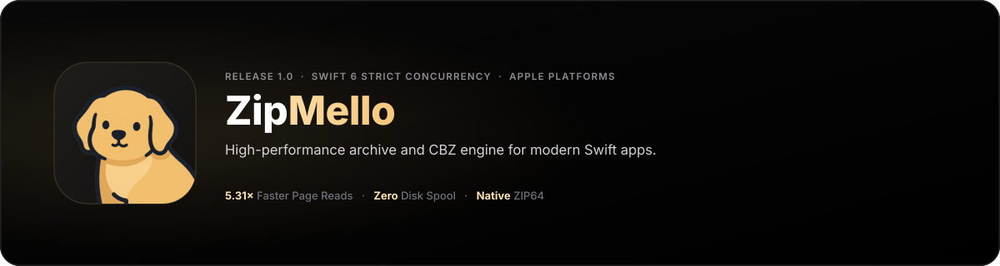

<p align="center">
  <picture>
    <source media="(prefers-color-scheme: dark)" srcset="assets/banner-dark.svg">
    <source media="(prefers-color-scheme: light)" srcset="assets/banner-light.svg">
    
  </picture>
</p>

<p align="center">
  <a href="https://github.com/ChrisRodStar/zipmello/actions/workflows/ci.yml"></a>
  <a href="https://github.com/ChrisRodStar/zipmello/releases/tag/v1.0.0"></a>
  
  
  
  <a href="LICENSE"></a>
</p>

---

**ZipMello** is a high-performance archive and compression engine built from the ground up for Swift 6. Designed as a modern, memory-safe replacement for legacy archive libraries, it pairs hardware-accelerated Darwin compression with Swift Concurrency to deliver lock-free random-access reads, atomic directory transactions, and zero-spool in-memory streaming.

---

### Highlights

- **Parallel $O(1)$ Positional Reads**: Independent, seek-lock-free positional reads (`pread`) across worker lanes without mutual exclusion bottlenecks.
- **Hardware-Vector CRC32**: Hardware-accelerated vector instructions (ARMv8 / SSE4.2) via Darwin `crc32`.
- **Pure In-Memory Processing**: Parse and decompress downloaded payloads directly from `Data` buffers without spooling temporary disk files.
- **ZIP64 Architecture**: Native support for archives containing $> 65,535$ entries or files exceeding $4\text{ GB}$.
- **Comic & Manga First-Class Support**: Bundled `ZipMelloConsumers` library provides high-speed CBZ page caching, memory-budgeted LRU leasing, and sanitizing `ComicInfo.xml` codecs.
- **Universal CLI Tool**: Bundled `zipmello` binary compiled fat for Apple Silicon (`arm64`) and Intel (`x86_64`).

---

## Performance Comparison

Measured head-to-head on Apple Silicon (`arm64`, Release `-O` builds) against [ZIPFoundation](https://github.com/weichsel/ZIPFoundation):

| Real-World Workload | ZIPFoundation | ZipMello | Advantage |
| :--- | :--- | :--- | :--- |
| **Random-Access Page Reads** *(80 pages from .cbz)* | 17.0 ms | **3.2 ms** | **5.31× faster** *(81% less time)* |
| **Concurrent Reads** *(32 parallel workers)* | 7.1 ms | **1.4 ms** | **4.93× faster** *(80% less time)* |
| **In-Memory Extraction** *(50 entries, 0 disk I/O)* | 6.3 ms | **2.0 ms** | **3.15× faster** *(68% less time)* |
| **Directory Extraction** *(500 files, 50 MB to disk)* | 83.2 ms | **40.0 ms** | **2.08× faster** *(52% less time)* |
| **Central Directory Inspection** *(5,000 entries)* | 14.2 ms | **8.0 ms** | **1.78× faster** *(44% less time)* |
| **Folder Archiving** *(500 files, 50 MB, DEFLATE)* | 120.4 ms | **110.1 ms** | **1.10× faster** *(9% less time)* |
| **Full Test Suite Execution** | 32.60 s | **0.75 s** | **43.5× faster** |

---

## Architectural Comparison

| Capability | ZIPFoundation | ZipMello |
| :--- | :--- | :--- |
| **Concurrency Model** | Serial locks / POSIX thread locks | 100% Swift 6 Actors & Sendable isolates |
| **Random Access** | Sequential search or re-scan | $O(1)$ pre-indexed byte offset map |
| **Hardware CRC32** | Scalar bitwise loop | ARMv8 / SSE4.2 SIMD vector extensions |
| **In-Memory Archives** | Temporary scratch file spooling | Direct pointer windowing into `Data` buffers |
| **Directory Extraction Safety** | Direct in-place writes (vulnerable to partial failures) | Atomic transaction via staging with full rollback |
| **Path Normalization** | Strict literal byte match | Case-folding, Unicode NFC/NFD, and alias resolution |
| **Comic & Reader Integrations** | None (requires external wrapper) | Built-in `ZipMelloConsumers` (CBZ page store & ComicInfo) |

---

## Installation

Add ZipMello to your `Package.swift`:

```swift
dependencies: [
    .package(url: "https://github.com/ChrisRodStar/zipmello.git", from: "1.0.0")
]
```

Add the products to your application or framework target:

```swift
.target(
    name: "YourApp",
    dependencies: [
        .product(name: "ZipMello", package: "zipmello"),
        // Optional: High-speed page caching & ComicInfo metadata:
        .product(name: "ZipMelloConsumers", package: "zipmello")
    ]
)
```

---

## Quickstart

### Read an Entry in One Line
```swift
import ZipMello

let data = try await ArchiveReader.read(entry: "chapter/001.jpg", from: archiveURL)
```

### Actor-Based Concurrent Reading
Keep an archive open across multiple views or background worker tasks:
```swift
import ZipMello

let reader = try await ArchiveReader.open(archiveURL)

// Read any entry with $O(1)$ lookup and zero seek lock:
let cover = try await reader.read("cover.jpg")

// Inspect all entries:
let listing = try await reader.listing()
for item in listing {
    print("\(item.path) — \(item.uncompressedSize) bytes")
}

await reader.close()
```

### Extract Archive with Atomic Rollback
Extraction unpacks into an atomic staging area and moves into place upon complete checksum verification:
```swift
import ZipMello

try await ArchiveReader.extractAll(
    from: archiveURL,
    to: destinationFolder,
    overwrite: true
)
```

### Create Compressed Archives
Archive an entire folder hierarchy with DEFLATE compression:
```swift
import ZipMello

try await ArchiveWriter.create(
    at: outputZipURL,
    from: sourceDirectoryURL,
    compression: .deflate
)
```

### In-Memory Extraction (Zero Disk I/O)
Ideal for downloaded network payloads in SwiftUI and cloud services:
```swift
import ZipMello

let memoryReader = try ArchiveMemoryReader(data: downloadedZipData)
let manifest = try memoryReader.read("manifest.json")
```

---

## Comic & Reader Support (`ZipMelloConsumers`)

ZipMello provides specialized primitives for reading applications (such as [Melloku](https://github.com/tinymelo)):

### Thread-Safe CBZ Page Store
Extracts and leases pages under a strict, configurable disk/memory budget:
```swift
import ZipMelloConsumers

let store = try ArchivePageStore(directory: cacheDirectory)
let lease = try await store.lease("001.jpg", from: comicArchiveURL)

// Access cached local URL:
let localImageURL = lease.url

// Release lease when the page scrolls off screen:
await lease.release()
```

### Sanitized ComicInfo XML Codec
Parse and serialize ComicRack/CBZ metadata with full XML injection immunity:
```swift
import ZipMelloConsumers

let comic = try await LocalComicArchive.open(comicArchiveURL)
let metadata = try await comic.metadata()

print("Title: \(metadata?.fields["Title"] ?? "Unknown")")
print("Total Pages: \(metadata?.pages.count ?? 0)")
```

---

## Universal CLI (`zipmello`)

ZipMello includes a fast, native command-line utility for macOS:

```bash
# Inspect archive contents & compression ratios
zipmello list /path/to/archive.cbz

# Display detailed metadata, ZIP64 status, and comment
zipmello info /path/to/archive.zip

# Extract archive to destination directory
zipmello extract /path/to/archive.zip /path/to/destination

# Create an archive from a folder
zipmello create /path/to/source_dir /path/to/output.zip

# Validate archive integrity and CRC32 checksums
zipmello validate /path/to/archive.zip
```

Pre-built universal binaries (`arm64` + `x86_64`) are available on the [Releases](https://github.com/ChrisRodStar/zipmello/releases) page.

---

## Documentation

- [Complete API Usage Guide](docs/USAGE.md)
- [Architecture & Engine Design](docs/ARCHITECTURE.md)

---

## License

ZipMello is open source software released under the [MIT License](LICENSE).

<p align="center">
  <br>
  <sub>Crafted with care by Melo.</sub>
</p>
