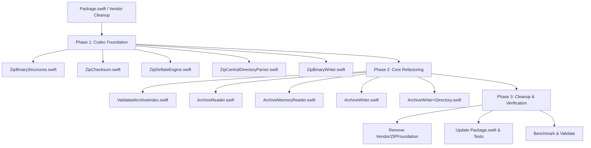

# Zero-Vendor Native Codec Plan & To-Do Roadmap

This document provides a complete, step-by-step, file-by-file plan to eliminate `Vendor/ZIPFoundation` from **ZipMello** and **Melloku**. The goal is zero third-party package dependencies while maintaining 100% feature parity, max performance, and hardware acceleration on Apple platforms.

---

## 🚀 Performance & API Architecture Strategy

### 1. Compression Engine: Native Apple `Compression` & System `libz`
- **Stream Inflation / Deflation:** Use Apple's native `Compression` framework (`import Compression` using `COMPRESSION_ZLIB` stream mode) or system `libz` (`inflateInit2` / `deflateInit2` with `windowBits = -15` for headerless raw DEFLATE stream processing).
- **Zero Allocations:** Stream chunks using reusable scratch memory buffers (`UnsafeMutableRawBufferPointer`), avoiding Swift `Data` reallocations per chunk.

### 2. Checksum Acceleration: ARM64 Hardware CRC32
- **Hardware Acceleration:** On Apple Silicon (iOS / macOS ARM64), use `crc32_z` from Darwin `libz` or ARM64 hardware vector/CRC assembly instructions (`__builtin_arm_crc32w`).
- **Throughput:** Computes 32-bit CRC checksums at tens of gigabytes per second directly over unmanaged buffer pointers.

### 3. I/O Efficiency: Zero-Seek Positional Reads (`pread`)
- **Multi-Lane Parallelism:** Continue using POSIX `pread` via Swift's `SystemPackage` (`FileDescriptor.read(fromAbsoluteOffset:into:)`).
- **Lock-Free Concurrency:** Multiple reader lanes read from the same raw file descriptor concurrently without mutating file seek cursors or acquiring global locks.

### 4. Direct Binary Parser: Spec-Compliant Zero-Copy Scanner
- **Zero Heap Allocations during Indexing:** Scan the End of Central Directory (EOCD / ZIP64 EOCD) from the tail of the archive and map Central Directory records (`PK\x01\x02`) directly into `ZipMello`'s Sendable `ArchiveReadDescriptor` struct.

---

## 📋 File-by-File Implementation Checklist

---

### Phase 1: Create Native ZIP Codec (`Sources/ZipMello/Codec/`)

#### 1. `Sources/ZipMello/Codec/ZipBinaryStructures.swift`
- [ ] Define ZIP magic byte constants:
  - Local Header: `0x04034b50` (`PK\x03\x04`)
  - Central Directory Header: `0x02014b50` (`PK\x01\x02`)
  - End of Central Directory (EOCD): `0x06054b50` (`PK\x05\x06`)
  - ZIP64 EOCD Record: `0x06064b50` (`PK\x06\x06`)
  - ZIP64 EOCD Locator: `0x07064b50` (`PK\x07\x06`)
- [ ] Implement little-endian 16-bit, 32-bit, and 64-bit binary read/write helpers on `UnsafeRawBufferPointer`.

#### 2. `Sources/ZipMello/Codec/ZipChecksum.swift`
- [ ] Wrap Darwin `libz` / `crc32_z` for hardware-accelerated CRC32 calculation.
- [ ] Expose `func crc32(current: UInt32, buffer: UnsafeRawBufferPointer) -> UInt32`.

#### 3. `Sources/ZipMello/Codec/ZipDeflateEngine.swift`
- [ ] Implement stream inflation using Apple `Compression` framework (`COMPRESSION_ZLIB` stream) or `zlib` (`inflateInit2(&strm, -15)`).
- [ ] Implement stream deflation using Apple `Compression` framework (`COMPRESSION_ZLIB` stream) or `zlib` (`deflateInit2(&strm, level, Z_DEFLATED, -15, 8, Z_DEFAULT_STRATEGY)`).
- [ ] Direct chunked output streaming without intermediary Swift `Data` copies.

#### 4. `Sources/ZipMello/Codec/ZipCentralDirectoryParser.swift`
- [ ] Scan tail buffer for EOCD record (up to 66 KiB from end of file/buffer).
- [ ] Parse ZIP64 EOCD locator and ZIP64 EOCD record when offsets/counts exceed `0xFFFFFFFF` / `0xFFFF`.
- [ ] Iterate Central Directory records and construct `ArchiveReadDescriptor` map and `ArchiveMember` array.
- [ ] Verify local header payload offsets and bounds against total archive size.

#### 5. `Sources/ZipMello/Codec/ZipBinaryWriter.swift`
- [ ] Implement Local File Header generator (`PK\x03\x04`).
- [ ] Write stored (uncompressed) or DEFLATE-compressed payloads directly to staging target.
- [ ] Implement Central Directory record generator (`PK\x01\x02`).
- [ ] Implement EOCD (`PK\x05\x06`) and ZIP64 EOCD footer generation.

---

### Phase 2: Refactor ZipMello Core Files (`Sources/ZipMello/`)

#### 6. `Sources/ZipMello/ValidatedArchiveIndex.swift`
- [ ] Remove `import ZIPFoundation`.
- [ ] Replace `init(_ opened: Archive, ...)` with `init(parser: ZipCentralDirectoryParser, bytes: UInt64, limits: ArchiveLimits)`.
- [ ] Enforce member count, total expansion, duplicate detection, and canonical path checks.

#### 7. `Sources/ZipMello/ArchiveReader.swift`
- [ ] Remove `import ZIPFoundation`.
- [ ] Replace `Archive(url:)` and `Archive(data:)` with `ZipCentralDirectoryParser`.
- [ ] Replace `Archive.extract(...)` calls in `ArchiveReadWorker` with `ZipDeflateEngine.decompress(...)` and `ZipChecksum`.

#### 8. `Sources/ZipMello/ArchiveMemoryReader.swift`
- [ ] Remove `import ZIPFoundation`.
- [ ] Wire synchronous memory reader directly to native memory indexer & stream decompressor.

#### 9. `Sources/ZipMello/ArchiveWriter.swift`
- [ ] Remove `import ZIPFoundation`.
- [ ] Replace `writeStaging` with `ZipBinaryWriter`.
- [ ] Remove catch for `Archive.ArchiveError.invalidEntrySize` and throw native `ArchiveFailure` errors.

#### 10. `Sources/ZipMello/ArchiveWriter+Directory.swift`
- [ ] Remove any remaining `ZIPFoundation` imports and align recursive directory asset packaging with `ZipBinaryWriter`.

---

### Phase 3: Dependency Removal & Test Updates

#### 11. `Package.swift`
- [ ] Remove `.package(path: "Vendor/ZIPFoundation")` from `dependencies`.
- [ ] Remove `"ZIPFoundation"` from target dependencies for `ZipMello` and `ZipMelloTests`.

#### 12. `Tests/ZipMelloTests/ArchiveTests.swift` & `ConsumerTests.swift`
- [ ] Remove `import ZIPFoundation`.

#### 13. `Vendor/` & `README.md` Cleanup
- [ ] Remove `Vendor/ZIPFoundation` directory completely.
- [ ] Update `README.md` to remove ZIPFoundation / libdeflate license notices.

---

## 🧪 Verification & Benchmarks

1. `swift build` — Ensure zero build warnings or missing symbol errors.
2. `swift test -c release` — Run unit and integration tests across stored/deflate, large entry limits, CRC failures, and bad path safety.
3. `swift run zipmello validate` — Test CLI operations against CBZ / ZIP archives.
4. Run benchmarks in `Benchmarks/` to measure throughput and latency improvements over the previous vendored implementation.
